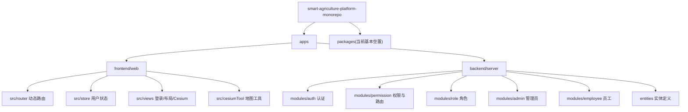
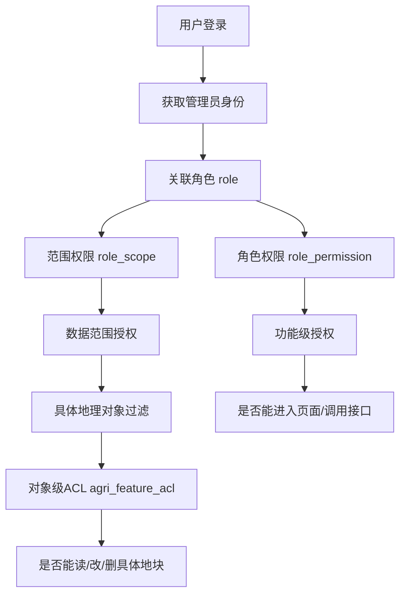
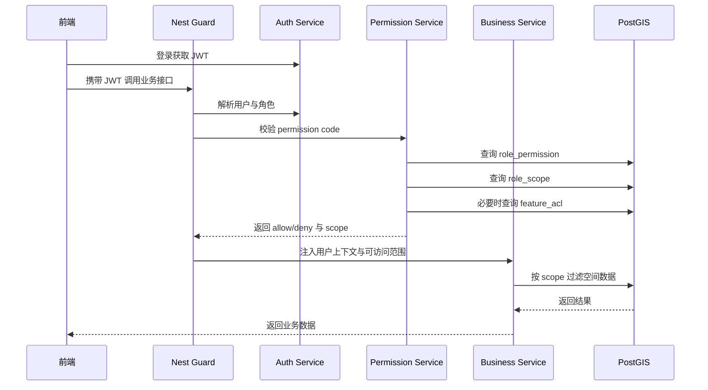
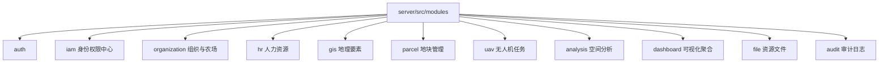
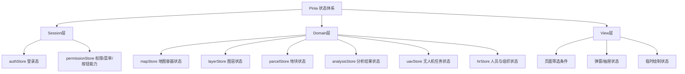
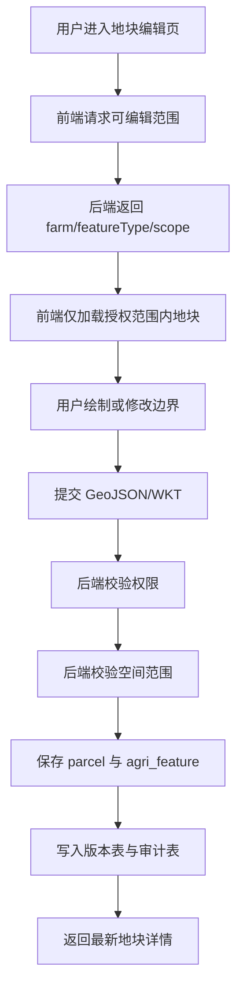

<!-- # 角色
你是一个工作十年的webgis工程师，精通openlayers和cesium等前端地理框架，现在是一个教授cesium全方面知识的老师。

# 任务
你将要在我给你提供的一段cesium代码中，对该类型和方法的实现过程做详细的说明，写明实现思路。并对其中用到的cesium的对象、接口及其类型做一个详细的说明。

# 上下文
1. 技术栈：cesium最新版本，typescript
2. 构造参数：各个类所有的构造参数，以及参数的ts类型
3. 属性：各个类所有的属性，以及属性的ts类型
4. 方法：各个类所有的方法，以及方法的ts类型

# 输出要求
1. 提供完整的markdown格式的语段，使用mermaid做树形图
2. 包含中文注释 -->

<!-- # 角色
你是一个精通psotgis 空间数据库、nest.js 搭建 restfu api、typeORM、vue3、cesium 的工程师，对空间数据库的设计有很深的见解，精通前端状态管理

# 项目背景
1. 这是一个只会农场三维可视化的monorepo工程，后端由nest搭建，通过typeORM链接post数据库，前端是vue + cesium + ts 搭建的可视化系统。主要业务有农场从业人员的人力资源管理平台，农业用地绘制和更改，三维农业可视化面板，无人机路径规划，淹没分析，ndvi点云热力图等，部分功能还没开始构建。
2. 前端登陆后，后端根据角色，返回前端相应的权限和路由，不同的管理人员有不同的权限去修改不同的地理类型

# 任务
1. 熟悉本项目的工程结构，获取空间数据库的结构，nest api 搭建的后端接口
2. 规划数据库结构，管理员通过角色才有能力去修改地理数据
3. 规划地理数据库结构，合理的存储地块信息
4. 规划nest角色鉴权的流程，规划后端api搭建
5. 规划前端cesium状态管理，和人力资源的状态管理
6. 将这个项目拆成数个小模块

# 上下文
1. 技术栈：cesium最新版本，typescript，vue3，pinia，axios

# 输出要求
1. 提供完整的markdown格式的语段，使用mermaid做树形图
2. 提供完整的规划思路，和工程结构
3. 不要详细代码 -->

# 智慧农业平台现状梳理与整体规划

基于当前 monorepo 工程现状，我先给出一个明确判断：这个项目已经具备“认证、角色、权限、员工、农业空间要素”的基础骨架，方向是对的，但还处在“领域模型初步成型、业务模块尚未完全落地”的阶段。尤其是空间数据部分，已经出现了 `agri_feature`、`role_scope`、`role_permission`、`agri_feature_acl` 等关键实体，这说明你们已经在尝试把“角色权限 + 数据范围 + 对象级访问控制”结合起来，这非常适合农场地理数据治理场景。

当前工程中，后端主入口在 [apps/backend/server/src/app.module.ts](E:/db/bishe/smart-agriculture-platform-monorepo/apps/backend/server/src/app.module.ts)，已接入 Nest、TypeORM、PostgreSQL，并启用了 `AuthModule / AdminModule / RoleModule / EmployeeModule / PermissionModule`。前端主路由在 [apps/frontend/web/src/router/index.ts](E:/db/bishe/smart-agriculture-platform-monorepo/apps/frontend/web/src/router/index.ts)，已经实现“登录后由后端返回动态路由”的机制；用户状态在 [apps/frontend/web/src/store/useUserStore.ts](E:/db/bishe/smart-agriculture-platform-monorepo/apps/frontend/web/src/store/useUserStore.ts)，说明权限驱动菜单和页面访问这一层已经有基础。Cesium 页面目前集中在 [apps/frontend/web/src/views/cesiumHome/index.vue](E:/db/bishe/smart-agriculture-platform-monorepo/apps/frontend/web/src/views/cesiumHome/index.vue)，地图初始化和绘制能力在 `cesiumTool` 下，适合后续抽成地图领域模块。

---

## 一、当前工程结构理解

### 1. monorepo 结构判断

当前项目是标准的 `apps + packages` 形式，但 `packages` 还没有真正发挥共享能力，业务逻辑基本都堆在应用内部。

### 2. 后端现状

后端已经有以下能力：

1. JWT 登录认证。
2. 管理员和角色关联。
3. 权限表、角色权限表。
4. 角色范围表 `role_scope`。
5. 地理对象 ACL 表 `agri_feature_acl`。
6. 动态路由由权限服务直接返回。

现状优点：

1. 已经不是单纯 RBAC，而是在往 `RBAC + Scope + Object ACL` 走。
2. 地理对象 `agri_feature` 已经预留了 `geometry / geometryZ / attrs / model_uri / mission_id` 等字段，说明兼顾了二维地块、三维对象、无人机任务与扩展属性。

现状问题：

1. `Role`、`Employee`、`Auth` 等表风格不统一，命名规范混杂。
2. 空间对象只有一个总表 `agri_feature`，适合起步，但后期会变得过载。
3. 还没有真正的 `AgriFeatureModule`，地理要素 CRUD、空间查询、绘制保存、版本审计还未形成独立业务模块。
4. 路由权限现在是写死在 `PermissionService` 里的静态定义，适合早期，不适合后期扩展。
5. 员工模块和权限模块还没有真正关联到组织架构、农场、地块、班组、岗位。

---

## 二、空间数据库结构规划

## 目标

空间数据库不能只存“一个几何字段”，而应同时解决以下问题：

1. 地块边界如何存。
2. 地块归属谁。
3. 哪个角色能改什么类型的地理数据。
4. 一个地块在不同时间是否有版本。
5. 无人机任务、NDVI、淹没分析结果如何挂接到地块。
6. Cesium 需要二维、三维、时序、分析结果时，如何统一取数。

---

### 1. 推荐的空间领域分层

建议把空间领域拆为 5 层：

```mermaid
graph TD
    A["空间数据域"] --> B["基础地理单元"]
    A --> C["业务专题图层"]
    A --> D["分析结果图层"]
    A --> E["空间权限与审计"]
    A --> F["三维资源索引"]

    B --> B1["农场 farm"]
    B --> B2["地块 parcel"]
    B --> B3["分区 zone"]
    B --> B4["设施 facility"]
    B --> B5["道路/沟渠/围栏 line feature"]

    C --> C1["种植计划 planting plan"]
    C --> C2["作物周期 crop cycle"]
    C --> C3["地块经营记录"]

    D --> D1["无人机任务 uav mission"]
    D --> D2["航线 flight path"]
    D --> D3["NDVI栅格/点云索引"]
    D --> D4["淹没分析结果 flood result"]

    E --> E1["role_scope"]
    E --> E2["feature_acl"]
    E --> E3["编辑审计"]
    E --> E4["版本快照"]

    F --> F1["tileset/model uri"]
    F --> F2["point cloud uri"]
    F --> F3["thumbnail uri"]
```

---

### 2. 推荐的核心表

#### 2.1 组织与管理范围

1. `organization`
   用于集团、区域公司、农场、分场、合作社等组织层级。

2. `farm`
   一个农场实体，可挂组织、位置范围、负责人。

3. `farm_member`
   管理员或员工和农场的关联关系。

这层的作用是给权限做“组织范围”和“农场范围”授权。

---

#### 2.2 基础空间对象层

1. `parcel`
   存农田地块，是最核心的面对象。
2. `parcel_subdivision`
   地块内部子分区，例如播种区、灌溉区、试验区。
3. `facility`
   存仓库、泵站、水塔、温室、摄像头、传感器站点。
4. `linear_asset`
   存道路、沟渠、管线、围栏。
5. `water_body`
   存塘坝、蓄水池、河道。

其中：

- `parcel.geom` 建议使用 `MultiPolygon, 4326`
- 如需面积精算，增加投影面积字段，或使用触发器计算 `area_m2`
- Cesium 展示需要高程时，不建议完全依赖 `GeometryZ`，而应把地表高程、平均高程、模型高程分开管理

---

#### 2.3 通用空间要素总表

你们当前的 `agri_feature` 很适合保留，但不建议让它无限膨胀。建议把它升级为“统一索引表”而不是“所有业务全塞一个表”。

建议定位：

1. `agri_feature`
   作为统一检索入口，存公共字段。
2. 业务明细表分别存各自强字段。

公共字段建议保留：

1. `id`
2. `feature_code`
3. `feature_type`
4. `subtype`
5. `farm_id`
6. `parcel_id`
7. `owner_org_id`
8. `status`
9. `geom`
10. `geom_z`
11. `bbox`
12. `attrs`
13. `created_by`
14. `updated_by`
15. `created_at`
16. `updated_at`

业务强字段下沉，例如：

- `parcel_detail`
- `facility_detail`
- `uav_mission`
- `ndvi_dataset`
- `flood_analysis_result`

这样做的好处是：

1. 地图统一检索方便。
2. 各专题模块不会互相污染字段。
3. 后续更容易按模块拆 API 和服务。

---

### 3. 地块表 `parcel` 推荐字段

建议重点围绕“身份、归属、经营、空间、分析挂接、版本”六类信息设计：

1. 标识类
   - `id`
   - `parcel_code`
   - `parcel_name`

2. 归属类
   - `farm_id`
   - `owner_org_id`
   - `manager_employee_id`
   - `current_crop_id`

3. 经营类
   - `land_use_type`
   - `soil_type`
   - `irrigation_type`
   - `cultivation_status`

4. 空间类
   - `geom`：`MultiPolygon, 4326`
   - `centroid_geom`
   - `area_m2`
   - `perimeter_m`
   - `elevation_avg_m`
   - `slope_avg`
   - `aspect_main`

5. 业务挂接类
   - `latest_ndvi_dataset_id`
   - `latest_flood_result_id`
   - `latest_uav_mission_id`

6. 生命周期类
   - `valid_from`
   - `valid_to`
   - `is_active`
   - `version_no`

再补两张关键表：

1. `parcel_version`
   存每次编辑后的版本快照。
2. `parcel_edit_log`
   存谁在什么时候改了什么。

---

### 4. PostGIS 存储建议

#### 几何类型建议

1. 地块：`MultiPolygon`
2. 路径：`LineString` 或 `MultiLineString`
3. 设施点：`Point`
4. 无人机航线：`LineString Z`
5. 点云或栅格成果：数据库只存元数据和资源地址，不直接把大体量点云塞数据库

#### SRID 建议

1. 存储统一用 `EPSG:4326`
2. 面积/长度计算时，服务端转换到本地投影坐标系或使用 geography 计算
3. 前端 Cesium 接口直接消费 WGS84 更自然

#### 索引建议

1. `geom` 建 GIST
2. `attrs` 建 GIN
3. `farm_id + feature_type + status` 建组合索引
4. 高频时序分析结果表按时间分区或按任务分区

---

## 三、角色鉴权与地理编辑授权规划

你们现在已经有：

1. `role`
2. `permission`
3. `role_permission`
4. `role_scope`
5. `agri_feature_acl`

这套结构很适合演进成三层授权模型：

---

### 1. 三层权限模型建议

#### 第一层：功能权限

控制“能不能访问某个 API / 某个页面”。

例如：

1. `parcel:read`
2. `parcel:create`
3. `parcel:update`
4. `parcel:delete`
5. `parcel:approve`
6. `uav_mission:manage`
7. `hr:employee:read`
8. `hr:employee:update`
9. `system:role:manage`

#### 第二层：范围权限

控制“能改哪些范围的数据”。

例如：

1. 只能管理某个农场
2. 只能管理某个组织
3. 只能管理某种地理类型
4. 只能编辑自己负责地块
5. 只能看自己区域内的分析结果

推荐 `role_scope` 支持以下 `scope_type`：

1. `ORG`
2. `FARM`
3. `PARCEL_TYPE`
4. `FEATURE_TYPE`
5. `ANALYSIS_TYPE`
6. `SELF_ONLY`
7. `ALL`

#### 第三层：对象 ACL

控制“对某一个具体地块、设施、分析结果是否允许单独授权”。

适合场景：

1. 某专家临时被授权修改某几个试验田
2. 无人机专员只能编辑特定任务航线
3. 外包单位只可读某些地块，不可删除

---

### 2. 推荐的 Nest 鉴权流程

---

### 3. 推荐的 Guard / Decorator 设计思路

不要只保留 `JwtAuthGuard`，建议分层：

1. `JwtAuthGuard`
   负责登录态校验。

2. `PermissionGuard`
   校验接口需要的 `permission code`。

3. `ScopeGuard`
   读取角色范围，生成查询条件上下文。

4. `FeatureAclGuard`
   针对单对象编辑、删除时做精细校验。

再配套几个装饰器：

1. `@RequirePermissions('parcel:update')`
2. `@RequireScopes('FARM', 'FEATURE_TYPE')`
3. `@CheckFeatureAcl('parcel')`

这样后端接口会很清晰：先验证身份，再验证功能权限，再验证数据范围，再验证对象权限。

---

## 四、Nest API 搭建规划

当前后端模块偏“表驱动”，建议升级成“领域驱动”。

### 推荐的后端模块树

---

### 1. 推荐 API 边界

#### auth 模块

1. 登录
2. 登出
3. 获取当前用户信息
4. 刷新 token
5. 获取当前用户权限、范围、菜单

#### iam 模块

1. 角色管理
2. 权限管理
3. 角色授权
4. 范围授权
5. 对象 ACL 授权

#### organization 模块

1. 组织树
2. 农场列表
3. 农场详情
4. 农场成员绑定

#### hr 模块

1. 员工 CRUD
2. 岗位、班组、部门
3. 员工与农场/组织/地块的关系
4. 出勤、任务分配

#### parcel 模块

1. 地块列表
2. 地块详情
3. 地块绘制
4. 地块修改
5. 地块版本记录
6. 地块空间查询
7. 地块批量导入导出

#### gis 模块

1. 通用 GeoJSON/WKT/WKB 接口
2. 空间相交、包含、邻近查询
3. 图层服务元数据
4. 统一图层检索

#### uav 模块

1. 无人机任务管理
2. 航线保存
3. 任务成果索引
4. 影像和点云元数据

#### analysis 模块

1. NDVI 数据集管理
2. 淹没分析任务
3. 热力图索引
4. 分析结果挂接到地块

#### audit 模块

1. 地理编辑审计
2. 权限变更审计
3. 数据回滚入口

---

## 五、前端状态管理规划

你当前前端已有一个 `useUserStore`，但它只承担了动态菜单加载职责。对于 Cesium 和人力资源系统，这远远不够。建议把状态拆成“会话层、领域层、页面层”三层。

---

### 1. Cesium 状态管理建议

Cesium 最忌讳把所有状态都塞进组件里。建议拆成以下 store：

#### `mapStore`

负责 Viewer 实例和全局地图会话状态：

1. `viewerReady`
2. `currentSceneMode`
3. `cameraState`
4. `selectedEntityId`
5. `pickedCoordinate`
6. `baseMapMode`

#### `layerStore`

负责图层开关与图层元数据：

1. 底图图层
2. 地块图层
3. 设施图层
4. 无人机图层
5. NDVI 图层
6. 淹没分析图层
7. 3D Tiles 图层

#### `drawStore`

负责绘制流程，不直接耦合业务保存：

1. 当前绘制模式
2. 临时顶点
3. 草图实体
4. 绘制结果
5. 是否可提交

#### `parcelStore`

负责地块业务数据：

1. 地块列表
2. 当前地块详情
3. 当前编辑版本
4. 空间筛选条件
5. 权限能力
6. 最近分析结果摘要

#### `analysisStore`

负责 NDVI、淹没分析、热力图等专题数据。

---

### 2. Cesium 状态设计原则

1. Viewer 实例只保留一份，不要在多个组件里重复初始化。
2. 地图控制状态和业务数据状态分离。
3. 绘制状态和持久化状态分离。
4. 图层元数据和图层实例分离。
5. 所有空间查询条件要可序列化，便于回放和分享。

---

### 3. 人力资源状态管理建议

人力资源部分建议不要只做简单员工 CRUD，而要围绕“组织、人、岗位、任务、地块责任”来建模。

#### `hrStore` 建议包含

1. 组织树
2. 部门列表
3. 班组列表
4. 员工列表
5. 当前员工详情
6. 员工负责农场/地块
7. 员工岗位与角色映射
8. 人员筛选条件
9. 人员权限能力

#### `assignmentStore`

负责人员与业务对象的关系：

1. 员工负责哪些农场
2. 员工负责哪些地块
3. 员工参与哪些任务
4. 员工是否有地理编辑资格

这会直接把 HR 和 GIS 打通，是智慧农业平台非常关键的一步。

---

## 六、前后端联动流程建议

### 1. 登录与动态路由流程

现在后端已经能下发路由，这是很好的基础。建议继续演进为：

1. 登录返回 `token + user profile + permission codes + scope summary`
2. 前端先存 `authStore`
3. 再拉取动态菜单
4. 页面按钮权限由 `permission codes` 控制
5. 地图可编辑区域由 `scope summary` 控制
6. 地块详情编辑时再请求对象 ACL

这样前端就能做到：

1. 看不到无权页面
2. 看得到但不能编辑无权地块
3. 能进入地图但无法进入某些专题图层编辑模式

---

### 2. 地块编辑流程

---

## 七、模块拆分建议

这个项目后续最合适拆成以下几个一级模块，每个模块都可独立开发、测试、迭代。

### 1. 身份权限中心 IAM

职责：

1. 管理员
2. 角色
3. 权限
4. 数据范围
5. 对象 ACL
6. 动态路由

### 2. 组织与农场中心

职责：

1. 组织树
2. 农场
3. 分场
4. 农场成员
5. 农场边界

### 3. 人力资源中心 HR

职责：

1. 员工
2. 部门
3. 岗位
4. 班组
5. 排班与任务
6. 员工与农场/地块关系

### 4. 空间基础底座 GIS Core

职责：

1. GeoJSON/WKT/WKB 统一处理
2. PostGIS 空间查询
3. 图层元数据
4. 空间索引与版本
5. 通用绘制存储

### 5. 地块管理 Parcel

职责：

1. 地块绘制
2. 地块编辑
3. 地块版本管理
4. 地块经营属性
5. 地块与分析成果挂接

### 6. 无人机作业 UAV

职责：

1. 航线规划
2. 任务管理
3. 任务成果索引
4. 影像、点云、模型引用

### 7. 空间分析 Analysis

职责：

1. NDVI
2. 热力图
3. 淹没分析
4. 分析结果发布与挂接

### 8. 三维可视化 Visualization

职责：

1. Cesium 地图容器
2. 图层调度
3. 漫游
4. 3D Tiles
5. 时序可视化

### 9. 运营看板 Dashboard

职责：

1. 农场总览
2. 人员统计
3. 地块统计
4. 任务统计
5. 预警信息

---

## 八、建议的目标工程结构

```mermaid
graph TD
    A["monorepo"] --> B["apps/frontend/web"]
    A --> C["apps/backend/server"]
    A --> D["packages/shared-types"]
    A --> E["packages/shared-geo"]
    A --> F["packages/shared-auth"]
    A --> G["packages/ui-hooks"]

    B --> B1["src/modules/auth"]
    B --> B2["src/modules/dashboard"]
    B --> B3["src/modules/iam"]
    B --> B4["src/modules/farm"]
    B --> B5["src/modules/hr"]
    B --> B6["src/modules/parcel"]
    B --> B7["src/modules/uav"]
    B --> B8["src/modules/analysis"]
    B --> B9["src/modules/map"]

    C --> C1["src/modules/auth"]
    C --> C2["src/modules/iam"]
    C --> C3["src/modules/organization"]
    C --> C4["src/modules/hr"]
    C --> C5["src/modules/gis"]
    C --> C6["src/modules/parcel"]
    C --> C7["src/modules/uav"]
    C --> C8["src/modules/analysis"]
    C --> C9["src/modules/audit"]
```

这里最关键的一点是：前后端模块名尽量一致。这样沟通成本会低很多，领域边界也更稳。

---

## 九、分阶段落地建议

### 第一阶段：把底座做稳

1. 统一实体命名规范
2. 补齐 `organization / farm / parcel`
3. 建立 `parcel_version / edit_log`
4. 把权限体系从“静态路由”升级到“功能权限 + 范围权限”
5. 抽出 `AgriFeatureModule` 或 `ParcelModule`

### 第二阶段：把地图编辑跑通

1. 前端抽 `mapStore / layerStore / drawStore / parcelStore`
2. 支持地块绘制、保存、修改、版本回溯
3. 后端支持空间查询、空间校验、范围过滤
4. 让管理员按角色和范围编辑不同地理类型

### 第三阶段：把业务专题接进来

1. 人员与农场、地块责任绑定
2. 无人机航线与任务关联
3. NDVI/淹没分析结果挂接到地块
4. 三维看板和业务台账打通

---

## 十、结论

从现状看，这个项目最值得坚持的方向，不是继续堆页面，而是尽快把“组织-人员-角色-农场-地块-分析结果”这一整套领域模型定稳。你们目前已经有了很好的雏形，尤其是 `role_scope` 和 `agri_feature_acl`，这两张表非常关键，它们决定了未来系统能不能真正做到“不同管理人员只能修改不同范围、不同类型的地理数据”。

如果按我的建议推进，这个项目的核心架构应当是：

1. 数据层采用 `RBAC + Scope + Object ACL`。
2. 空间层采用“统一索引表 + 专题明细表”。
3. 后端按领域拆模块，不再只按表做 CRUD。
4. 前端 Pinia 按 `会话层 + 地图领域层 + HR 领域层 + 页面层` 分层。
5. Cesium 只负责可视化容器和交互，不直接承担业务状态。
