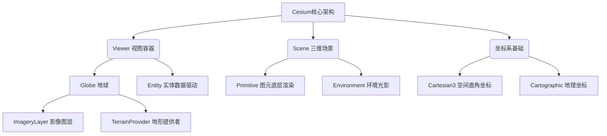

你好！欢迎来到Cesium的进阶课堂。作为一名在WebGIS领域摸爬滚打了十年的老兵，我深知在构建复杂的三维空间可视化平台（尤其是需要承载海量点云、实时渲染大面积地表和精细化地块的系统）时，扎实的底层API知识是决定项目性能和可扩展性的关键。

Cesium的API非常庞大，为了方便你建立全局视角，我们先用一张树形图来看看今天我们要深度解剖的这几个核心类在Cesium架构中的位置关系：

接下来，我为你梳理这些核心类的构造参数、属性和方法，并附上TypeScript的类型定义。由于Cesium源码极其庞大，这里提取的是**最核心且在实际工程中必定会用到**的全量核心骨架API。

---

### 1. 地球核心容器：`Viewer` & `Globe`
`Viewer` 是整个Cesium的三维视窗，而 `Globe` 是场景中的地球椭球体本身。

#### Viewer 构造与核心API
**构造参数:** `new Cesium.Viewer(container: Element | string, options?: Viewer.ConstructorOptions)`

| 参数/属性/方法名          | TS类型                      | 说明 (中文注释)                       |
| :------------------------ | :-------------------------- | :------------------------------------ |
| **Constructor Options**   | `Viewer.ConstructorOptions` | **构造配置项**                        |
| `animation`               | `boolean`                   | 是否显示动画控件 (左下角仪表盘)       |
| `baseLayerPicker`         | `boolean`                   | 是否显示底图切换控件                  |
| `terrainProvider`         | `TerrainProvider`           | 地形数据提供者                        |
| `imageryProvider`         | `ImageryProvider`           | 基础影像图层提供者                    |
| `infoBox`                 | `boolean`                   | 是否显示信息框 (点击Entity弹出的面板) |
| **Properties (属性)**     |                             |                                       |
| `scene`                   | `Scene`                     | 获取底层三维场景对象                  |
| `camera`                  | `Camera`                    | 获取当前相机对象                      |
| `entities`                | `EntityCollection`          | 获取默认的Entity集合容器              |
| `imageryLayers`           | `ImageryLayerCollection`    | 获取当前所有的影像图层集合            |
| **Methods (方法)**        |                             |                                       |
| `flyTo(target, options?)` | `Promise<boolean>`          | 视角飞行到指定实体或数据源            |
| `zoomTo(target, offset?)` | `Promise<boolean>`          | 视角瞬间缩放到指定目标                |
| `destroy()`               | `void`                      | 销毁Viewer对象，释放WebGL资源         |

---

### 2. 影像图层：`ImageryLayer`
用于叠加栅格瓦片数据，支持多图层叠加。

**构造参数:** `new Cesium.ImageryLayer(imageryProvider: ImageryProvider, options?: ImageryLayer.ConstructorOptions)`

| 参数/属性/方法名        | TS类型                                   | 说明 (中文注释)              |
| :---------------------- | :--------------------------------------- | :--------------------------- |
| **Constructor Options** | `{ alpha?: number, show?: boolean, ...}` | **构造配置项**               |
| `imageryProvider`       | `ImageryProvider`                        | 必须。提供瓦片图像的服务接口 |
| `alpha`                 | `number \| ImageryLayer.ValueFunc`       | 图层透明度，0.0 到 1.0       |
| `show`                  | `boolean`                                | 图层是否可见                 |
| **Properties (属性)**   |                                          |                              |
| `brightness`            | `number`                                 | 影像亮度 (默认 1.0)          |
| `contrast`              | `number`                                 | 影像对比度 (默认 1.0)        |
| `hue`                   | `number`                                 | 影像色调                     |
| **Methods (方法)**      |                                          |                              |
| `isDestroyed()`         | `boolean`                                | 返回对象是否已被销毁         |
| `destroy()`             | `void`                                   | 销毁图层                     |

---

### 3. 地形：`TerrainProvider` (以 `CesiumTerrainProvider` 为例)
地形用于呈现地表的起伏状态。在最新版Cesium中，推荐使用工厂方法异步创建地形。

**异步创建方法:** `Cesium.CesiumTerrainProvider.fromUrl(url: string | Resource, options?: options)`

| 参数/属性/方法名                       | TS类型                                    | 说明 (中文注释)                      |
| :------------------------------------- | :---------------------------------------- | :----------------------------------- |
| **fromUrl Options**                    | `{ requestVertexNormals?: boolean, ... }` | **配置项**                           |
| `requestVertexNormals`                 | `boolean`                                 | 是否请求顶点法线（用于光照阴影计算） |
| `requestWaterMask`                     | `boolean`                                 | 是否请求水面掩膜（用于水面波纹效果） |
| **Properties (属性)**                  |                                           |                                      |
| `availability`                         | `TileAvailability`                        | 获取该地形数据的可用层级范围         |
| `hasVertexNormals`                     | `boolean`                                 | 只读，该地形是否包含法线数据         |
| `hasWaterMask`                         | `boolean`                                 | 只读，该地形是否包含水面掩膜         |
| **Methods (方法)**                     |                                           |                                      |
| `requestTileGeometry(x, y, level)`     | `Promise<TerrainData> \| undefined`       | 请求特定瓦片的地形几何数据           |
| `getLevelMaximumGeometricError(level)` | `number`                                  | 获取指定级别的最大几何误差           |

---

### 4. 环境：`Environment` (包含在 `Scene` 中)
环境涵盖了天空盒、大气层、雾效和日月星辰。

| 参数/属性/方法名     | TS类型          | 说明 (中文注释)                            |
| :------------------- | :-------------- | :----------------------------------------- |
| **Scene Properties** |                 | **挂载在 scene 下的属性**                  |
| `skyAtmosphere`      | `SkyAtmosphere` | 大气层对象（控制地球边缘光晕等）           |
| `skyBox`             | `SkyBox`        | 天空盒（外太空星空背景）                   |
| `fog`                | `Fog`           | 雾效对象（控制远景雾化，提升性能和真实感） |
| `sun`                | `Sun`           | 太阳对象                                   |
| `moon`               | `Moon`          | 月亮对象                                   |
| **Fog Properties**   |                 | **fog对象的具体属性**                      |
| `enabled`            | `boolean`       | 是否开启雾效                               |
| `density`            | `number`        | 雾的密度控制参数                           |

---

### 5. 坐标系：`Cartesian3` & `Cartographic`
GIS开发的基础。`Cartesian3` 是空间直角坐标（X, Y, Z），`Cartographic` 是地理坐标（经度，纬度，高度——注意内部单位为弧度）。

#### `Cartesian3`
**构造参数:** `new Cesium.Cartesian3(x?: number, y?: number, z?: number)`

| 参数/属性/方法名                 | TS类型       | 说明 (中文注释)              |
| :------------------------------- | :----------- | :--------------------------- |
| **Properties (属性)**            |              |                              |
| `x`, `y`, `z`                    | `number`     | X, Y, Z 轴坐标分量           |
| **Static Methods (静态方法)**    |              |                              |
| `fromDegrees(lon, lat, height?)` | `Cartesian3` | 从经纬度(度)转换为世界坐标   |
| `fromRadians(lon, lat, height?)` | `Cartesian3` | 从经纬度(弧度)转换为世界坐标 |
| `distance(left, right)`          | `number`     | 计算两个点之间的欧氏距离     |

#### `Cartographic`
**构造参数:** `new Cesium.Cartographic(longitude?: number, latitude?: number, height?: number)`

| 参数/属性/方法名                 | TS类型         | 说明 (中文注释)            |
| :------------------------------- | :------------- | :------------------------- |
| **Properties (属性)**            |                |                            |
| `longitude`                      | `number`       | 经度 (弧度制 Radians)      |
| `latitude`                       | `number`       | 纬度 (弧度制 Radians)      |
| `height`                         | `number`       | 椭球上方的高度 (米)        |
| **Static Methods (静态方法)**    |                |                            |
| `fromDegrees(lon, lat, height?)` | `Cartographic` | 将度数转为弧度制的制图坐标 |
| `fromCartesian(cartesian, ...)`  | `Cartographic` | 将世界坐标转为地理制图坐标 |

---

### 6. 数据驱动实体：`Entity`
`Entity` 是基于数据驱动的高级API，非常适合做业务逻辑的数据绑定，封装了底层的复杂数学计算。

**构造参数:** `new Cesium.Entity(options?: Entity.ConstructorOptions)`

| 参数/属性/方法名        | TS类型                           | 说明 (中文注释)                                 |
| :---------------------- | :------------------------------- | :---------------------------------------------- |
| **Constructor Options** | `Entity.ConstructorOptions`      | **构造配置项**                                  |
| `id`                    | `string`                         | 实体的唯一标识符，未指定则自动生成              |
| `name`                  | `string`                         | 实体名称，常用于UI展示                          |
| `position`              | `PositionProperty \| Cartesian3` | 实体的位置 (支持动态属性绑定)                   |
| `show`                  | `boolean`                        | 实体是否可见                                    |
| **Graphics Properties** |                                  | **各类图形组件属性**                            |
| `point`                 | `PointGraphics`                  | 点图形组件 (当你需要动态绘制点云表面时非常有用) |
| `polygon`               | `PolygonGraphics`                | 多边形图形组件                                  |
| `model`                 | `ModelGraphics`                  | 3D模型组件 (glTF)                               |
| `properties`            | `PropertyBag`                    | 自定义业务属性（可用于存放遥感指标等计算结果）  |
| **Methods (方法)**      |                                  |                                                 |
| `isDestroyed()`         | `boolean`                        | 检查实体是否销毁                                |

---

### 7. 底层图形：`Primitive`
`Primitive` 更加贴近 WebGL 底层。当你需要高性能渲染海量要素（例如由成千上万个点构成的面、或者复杂的热力图贴花）时，使用 `Primitive` 是最佳实践。

**构造参数:** `new Cesium.Primitive(options?: Primitive.ConstructorOptions)`

| 参数/属性/方法名        | TS类型                                   | 说明 (中文注释)                      |
| :---------------------- | :--------------------------------------- | :----------------------------------- |
| **Constructor Options** | `Primitive.ConstructorOptions`           | **构造配置项**                       |
| `geometryInstances`     | `GeometryInstance \| GeometryInstance[]` | 要渲染的几何体实例或集合             |
| `appearance`            | `Appearance`                             | 外观材质配置（控制着色器渲染逻辑）   |
| `show`                  | `boolean`                                | 是否渲染此图元                       |
| `modelMatrix`           | `Matrix4`                                | 局部到世界坐标的变换矩阵             |
| `asynchronous`          | `boolean`                                | 是否异步创建WebGL资源 (默认true)     |
| **Properties (属性)**   |                                          |                                      |
| `ready`                 | `boolean`                                | 只读，判断图元的资源是否已准备好     |
| **Methods (方法)**      |                                          |                                      |
| `update(frameState)`    | `void`                                   | 每帧渲染时自动调用，用于更新图元状态 |
| `isDestroyed()`         | `boolean`                                | 是否被销毁                           |
| `destroy()`             | `void`                                   | 彻底销毁释放显存                     |

---

**老师的嘱咐：**
对于上述API，`Entity` 适合快速搭建和普通交互，而 `Primitive` (结合 `Geometry` 和 `Appearance`) 则是你突破性能瓶颈的利器。如果在实际开发中，你正在编写涉及空间算法处理后返回顶点信息并渲染的类，强烈建议深入 `Primitive` 的 `geometryInstances` 参数机制。

接下来，你想先从哪一个类的实际代码应用（比如用 Primitive 绘制大量点状数据）开始深入探讨呢？