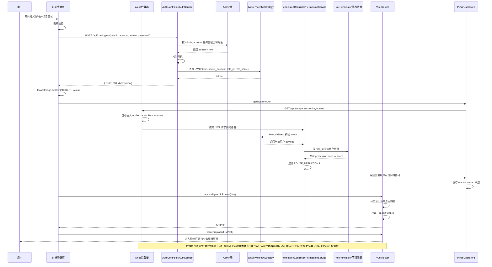

```mermaid
sequenceDiagram
    participant U as 用户
    participant FE as 前端登录页
    participant AX as Axios拦截器
    participant AU as AuthController/AuthService
    participant DB as Admin表
    participant JWT as JwtService/JwtStrategy
    participant PERM as PermissionController/PermissionService
    participant RP as RolePermission等权限表
    participant RT as Vue Router
    participant ST as Pinia/UserStore

    U->>FE: 输入账号密码并点击登录
    FE->>FE: 表单校验
    FE->>AU: POST /api/crm/login\n{ admin_account, admin_password }

    AU->>DB: 按 admin_account 查询管理员和角色
    DB-->>AU: 返回 admin + role
    AU->>AU: 校验密码
    AU->>JWT: 签发 JWT\n{sub, admin_account, role_id, role_name}
    JWT-->>AU: token
    AU-->>FE: { code: 200, data: token }

    FE->>FE: localStorage.setItem("TOKEN", token)
    FE->>ST: getRouter(true)

    ST->>AX: GET /api/crm/permission/my-routes
    AX->>AX: 自动注入 Authorization: Bearer token
    AX->>PERM: 携带 JWT 请求我的路由

    PERM->>JWT: JwtAuthGuard 校验 token
    JWT-->>PERM: 返回当前用户 payload
    PERM->>RP: 按 role_id 查询角色权限
    RP-->>PERM: 返回 permission codes / scope
    PERM->>PERM: 过滤 ROUTE_DEFINITIONS
    PERM-->>ST: 返回当前用户可访问路由树

    ST->>ST: 保存 menu / loaded 状态
    FE->>RT: ensureDynamicRoutes(true)
    RT->>RT: 动态注册后端返回路由
    RT->>RT: 找第一条可访问路径
    RT-->>FE: firstPath
    FE->>RT: router.replace(firstPath)
    RT-->>U: 进入系统首页/首个有权限页面

    Note over RT,AX: 后续每次访问受保护页面时：\n1. 路由守卫先检查本地 TOKEN\n2. 请求拦截器继续自动带 Bearer Token\n3. 后端用 JwtAuthGuard 做鉴权

```